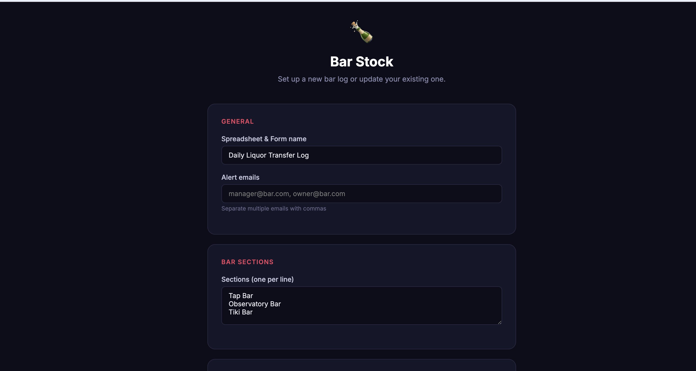
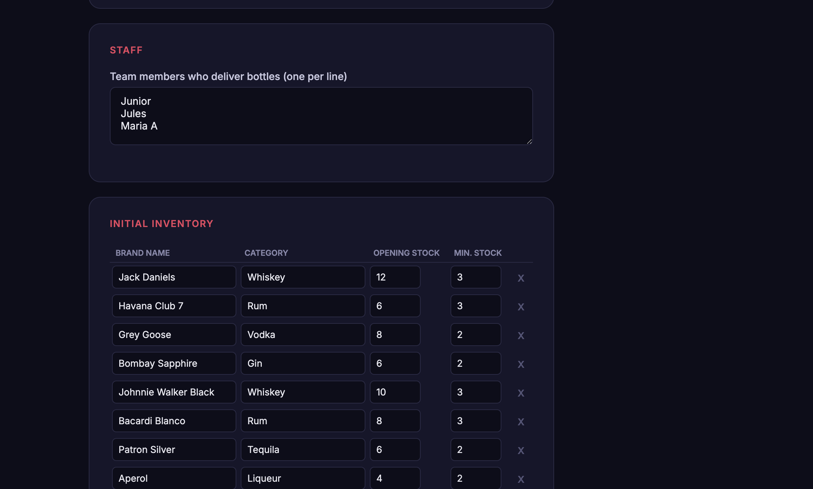
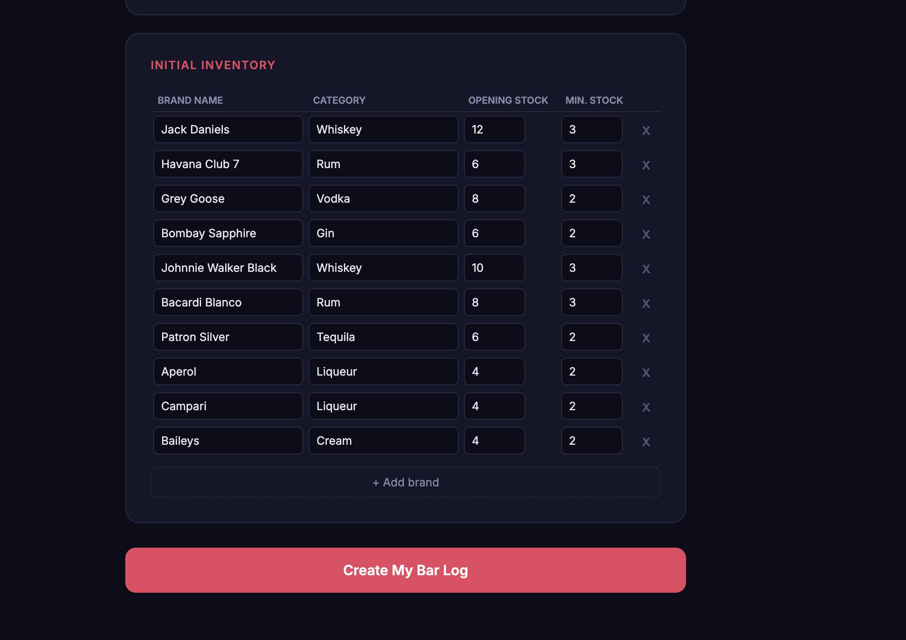
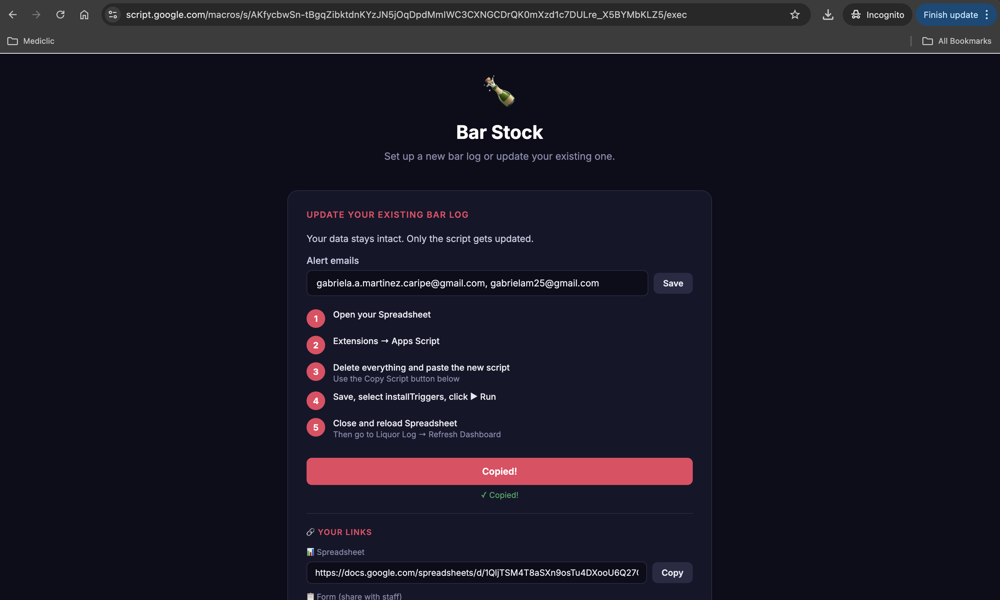
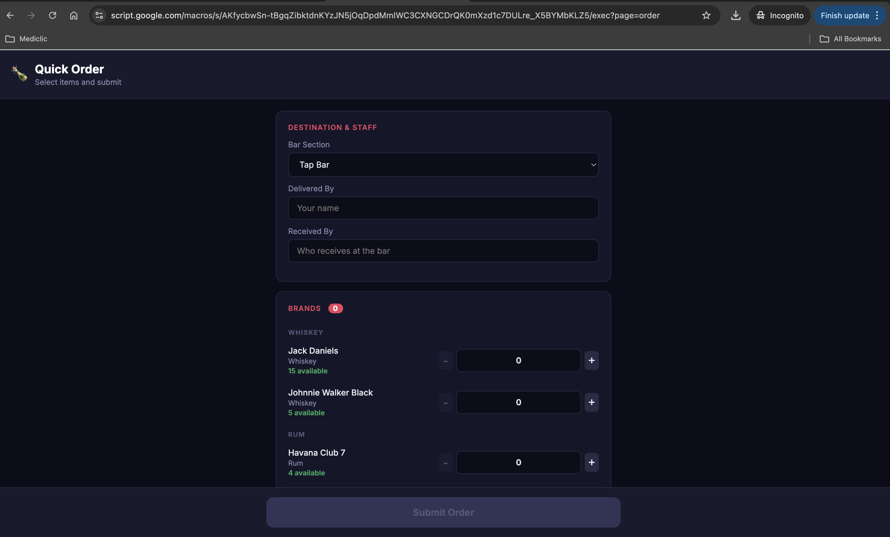
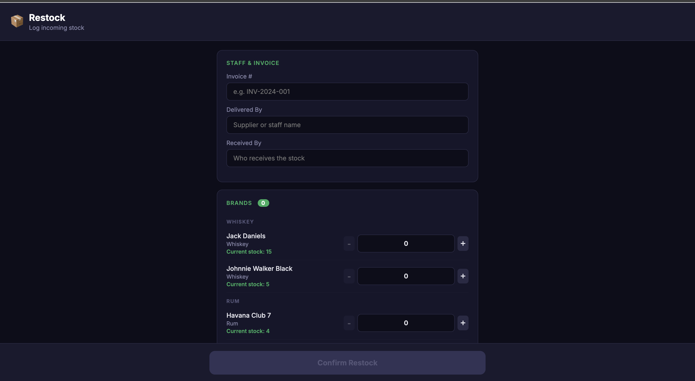
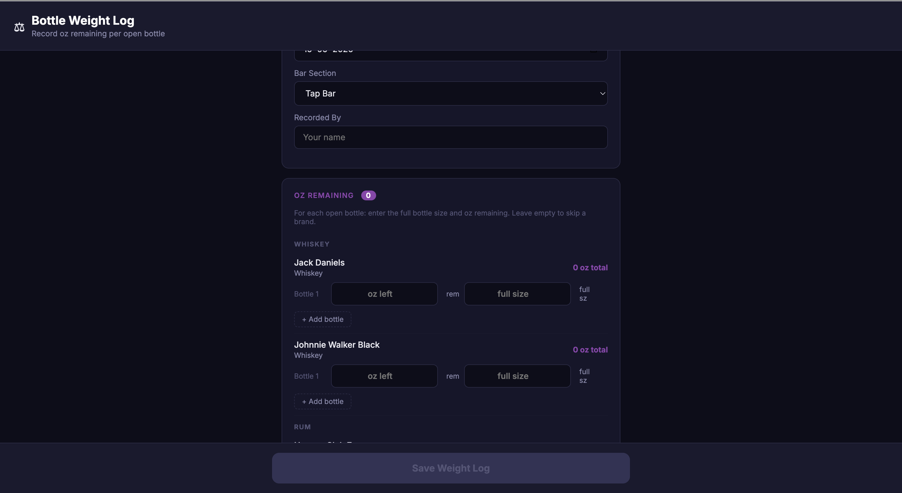
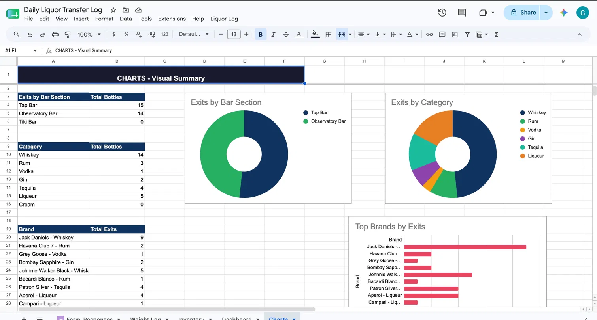
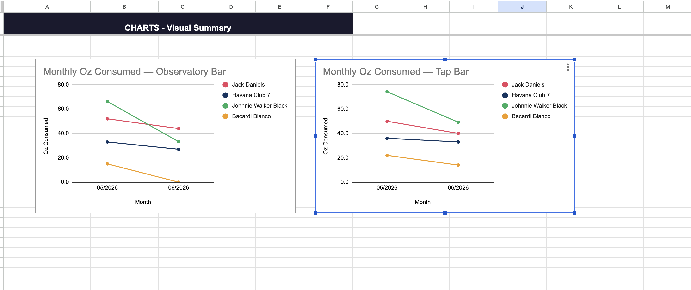

# 🍾 Bar Stock — Daily Liquor Transfer Log

A Google Apps Script web app for managing bar inventory. Tracks bottle transfers between storage and bar sections, logs restocks, records open bottle weights, and sends low-stock email alerts — all backed by a Google Spreadsheet, with zero infrastructure cost.

Built for a real bar operation managing multiple sections (Tap Bar, Observatory Bar, Tiki Bar).

---

## What It Does

- **Setup wizard** — one-time configuration creates the Spreadsheet, Form, and all sheets automatically
- **Quick Order** — managers select bottles and quantities to transfer to a bar section; logged instantly
- **Restock** — logs incoming stock from suppliers with invoice number tracking
- **Bottle Weight Log** — records oz remaining per open bottle per section; generates monthly consumption trend charts
- **Inventory tracking** — real-time stock levels via Spreadsheet formulas (entries − exits + opening stock)
- **Low stock alerts** — email notification when any brand drops below its minimum threshold
- **Daily summary email** — end-of-day report with all movements and inventory status
- **Dashboard** — consumption by bar section, top brands by exits, breakdown by category
- **Charts sheet** — pie charts (exits by section, by category), bar chart (top brands), line charts (monthly oz consumed per bar)

---

## Screenshots

**Web App — Setup**





**Web App — Management & Links**




**Web App — Operations**

| Quick Order | Restock | Bottle Weight Log |
|---|---|---|
|  |  |  |

**Google Spreadsheet — Auto-generated Charts**


*Exits by Bar Section (donut), Exits by Category (donut), Top Brands by Exits (horizontal bar)*


*Monthly oz consumed per brand, one line chart per bar section — updated automatically from the Bottle Weight Log*

---

## Architecture

```
Google Apps Script (Web App)
│
├── doGet(page)          ← routes to Setup / Quick Order / Restock / Weight Log
├── runSetup()           ← creates Spreadsheet + Form on first run
├── loadInventory()      ← reads Inventory sheet for the web UIs
├── submitOrder()        ← appends to Form_Responses, triggers low-stock check
├── submitRestock()      ← appends entry rows to Form_Responses
├── submitWeight()       ← writes to Weight Log sheet
│
└── Google Spreadsheet
    ├── Form_Responses   ← all movements (entries & exits)
    ├── Inventory        ← brands + formulas for real-time stock
    ├── Dashboard        ← consumption by section & category
    ├── Charts           ← auto-generated charts
    └── Weight Log       ← oz remaining per bottle per session
```

The web app and the Spreadsheet are **two separate Apps Script projects** — the web app handles the UI and writes data, while a management script inside the Spreadsheet handles triggers, dashboard refresh, and email reports.

---

## Setup

### Prerequisites

- A Google account
- No servers, no dependencies, no installs

### Deploy the Web App

1. Open [Google Apps Script](https://script.google.com) → **New project**
2. Paste the contents of `Code.gs` into the editor
3. Click **Deploy → New deployment**
   - Type: **Web App**
   - Execute as: **Me**
   - Who has access: **Anyone** (or "Anyone within your organization")
4. Copy the deployment URL

### First-time Setup

Open the web app URL. You'll see the setup wizard:

1. Enter a name for the Spreadsheet and Form
2. Add alert email addresses (comma-separated)
3. List your bar sections (one per line)
4. List your staff members who deliver bottles
5. Enter your initial inventory (brand, category, opening stock, minimum stock)
6. Click **Create My Bar Log**

The app will create everything in your Google Drive (~45 seconds).

### Activate the Management Script

After setup, follow the one-time activation steps shown in the app:

1. Open the created Spreadsheet
2. **Extensions → Apps Script**
3. Delete all existing code and paste the management script (use the **Copy Script** button in the web app)
4. Save → select **installTriggers** → click **▶ Run** → authorize permissions
5. Close and reload the Spreadsheet

This installs the triggers for form submissions, weight log changes, and the nightly email report.

---

## Usage

### Quick Order (for managers)
`?page=order`

Select the destination bar section, enter who is delivering and receiving, then use +/− to set quantities per brand. Bottles at or below minimum are flagged. Submit logs the transfer and triggers a low-stock check.

### Restock (for managers)
`?page=restock`

Log incoming stock from suppliers. Enter invoice number, supplier name, and receiving staff. Select quantities received per brand and confirm.

### Bottle Weight Log (for managers)
`?page=weight`

For each open bottle on hand: enter oz remaining and optionally the full bottle size (to calculate consumption). Multiple bottles per brand are supported. Data feeds the monthly trend charts automatically.

### Google Form (for staff)
The setup creates a standard Google Form for manual entry — useful for cases where the web app isn't available. Share the form URL with bar staff.

---

## Spreadsheet Structure

| Sheet | Purpose |
|---|---|
| `Form_Responses` | All movements — auto-populated by form and web app |
| `Inventory` | Master brand list with real-time stock via SUMPRODUCT formulas |
| `Dashboard` | Summary by bar section, top brands, consumption by category |
| `Charts` | Pie + bar + line charts, auto-refreshed from Weight Log |
| `Weight Log` | Date / bar / brand / oz remaining / full size / recorded by |

### Inventory columns

| Column | Value |
|---|---|
| A | Brand name |
| B | Category |
| C | Opening stock (manual, blue) |
| D | Total entries (formula) |
| E | Total exits (formula) |
| F | Current stock = C + D − E |
| G | Minimum stock (manual, blue) |
| H | Alert status: OK / LOW / OUT OF STOCK |

Row color coding: 🟢 green = OK, 🟡 orange = LOW, 🔴 red = OUT OF STOCK.

---

## Email Alerts

**Low stock alert** — triggered automatically after each Quick Order or Form submission if any brand falls at or below its minimum.

**Daily summary** — sent at 11 PM (configurable) with all movements for the day and full inventory status.

Alert emails are configured in the setup wizard and can be updated later via **Manage my Bar Log → Alert emails → Save**.

---

## Spreadsheet Menu

After installing the management script, a **Liquor Log** menu appears in the Spreadsheet:

- **Sync brands to Form** — updates the Form dropdown when you add new brands to Inventory
- **Refresh Dashboard** — rebuilds the dashboard with current data
- **Refresh Charts** — rebuilds all charts
- **Send daily report now** — triggers the summary email immediately
- **Fix Inventory formulas** — repairs SUMPRODUCT formulas if rows were manually edited
- **Install triggers** — reinstalls all triggers (use if emails stop working)

---

## Updating

To update the management script after making changes:

1. Open the web app → **Manage my Bar Log**
2. Update alert emails if needed → Save
3. Click **Copy New Script to Clipboard**
4. Open Spreadsheet → Extensions → Apps Script → replace all code → Save → run **installTriggers**

---

## Notes

- The web app URL changes with each new deployment. Use **Manage existing deployment** to update code without changing the URL.
- LinkedIn and external services are not used — everything runs inside Google's ecosystem.
- The Spreadsheet ID is stored in Apps Script User Properties, so the web app finds the right sheet automatically.
- For multi-account setups (web app under one Google account, Spreadsheet under another), the script must be deployed under the account that owns the Spreadsheet.

---

## License

MIT